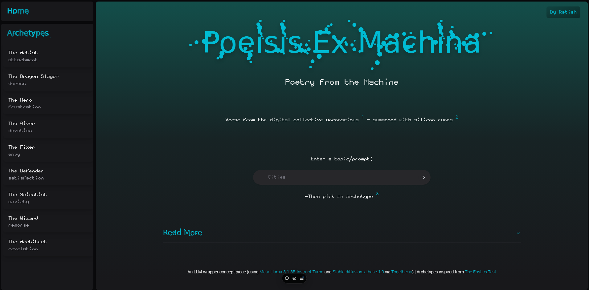

# Poiesis Ex Machina (Poetry From The Machine)

Poiesis Ex Machina is an LLM wrapper concept piece that generates poems + related imagery based on user-picked archetypes and user-entered prompts. 

The design, UI and intended use of this web app is based on the symbolism and potential of generative ai models from a philosophical perspective. 

From a more technical point of view, this web app is also an example showcasing the potential of the Astro framework for frontend development (and its flexibility allowing the use of other Javascript/Typescript framework elements within in, like React, which is used extensively here) with a serverless, stateless backend included. 

## Aesthetic 

According to Claude: Cyberpunk and Tech-Noir. 

## Live Demo

Try it out at [Poiesis Ex Machina](https://poiesis-ex-machina.vercel.app/)

## About 

The recent AI explosion is well documented. Although work on these lines has been done for decades, only recently has the widespread commercial and individual adoption of this technology become possible with the convergence of 3 decades' worth of human created data on the internet plus the countless other previous human works, and the compute per price increases compounded by Moore's law continuing over decades. 

AI models are trained on countless human-produced data- essentially 
forming a reflection of humankind's collective unconscious, frozen and distilled in the form of its weights, whatever neural net architectures represent them. The sum
total of the human produced data fed into them, abstracted down to numbers. A digital collective human unconscious. 

When prompted and an inference runs on them made, a series of matrix multiplications is set into motion. Computation occurs and electricity moves across tiny, intricately designed chips-
small but effective, some of the most complex machinery forgeed by humanity. 

The flipping of transistors happens en masse- something unremarkable on the individual level, but on the whole creating something bigger than the sum of its parts. The neural net of the 
model being run is brought to life- a microcosm of the metaphorical human spirit rendered real. 

And finally, an output is produced. Different every time if rerun with the same prompt, what with inference runs being stochastic, but still striking. 

Poetry and art are not new concepts- these human endeavours have been pursued since the beginning of recorded history. The emotions and feelings that poetry and art invoke are vast and myriad- 
but there _are_ common themes and patterns to them, as any sociologian/historian can confirm. And what are our brains, and the neural circuitry-inspired artificial intelligences we've made, 
if not pattern learning- and replication machines? 

### Maxims 

1. LLMs can be interpreted as techno-manifestations of (the Jungian concept of) the collective unconscious of humanity.

2. Running LLMs on chips of silicon is like bringing them to life and consciousness- briefly.

3. A face of the LLM Shoggoth must be picked before it is prompted.

## Tech Stack

Poiesis Ex Machina is built with the Astro framework and a few serverless javascript functions (`/api/index.js`) and deployed on Vercel. React and Svelte components are used in Astro "islands",
and the [Spotify Clone with Astro View Transitions](https://github.com/igorm84/spotify-astro-transitions) site was used as a template. Shadcn/ui components are used as well. 

## Deployment 

- Clone this repo 
- Download dependencies with `npm install` 
- Add Mongodb Atlas URI and Together.ai API key to a .env file (or add to the environment variables section on Vercel)
- Deploy in development mode with `npm run dev` and in prod mode with `npm run build` 
